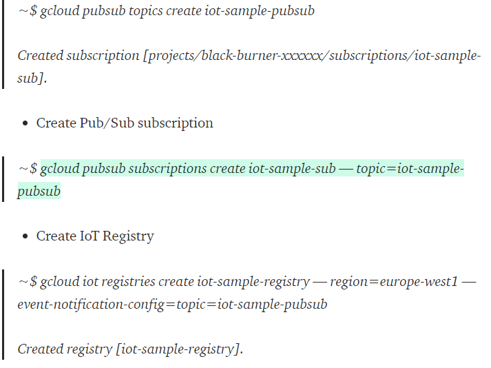
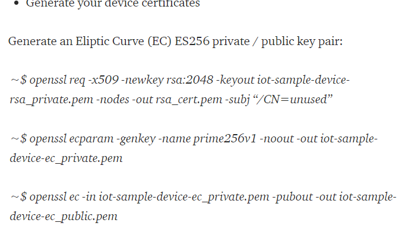
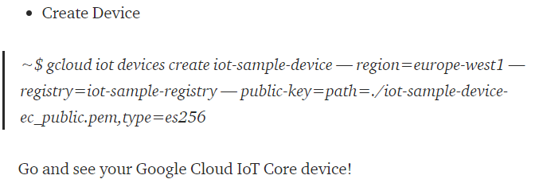
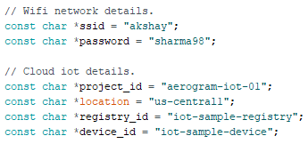
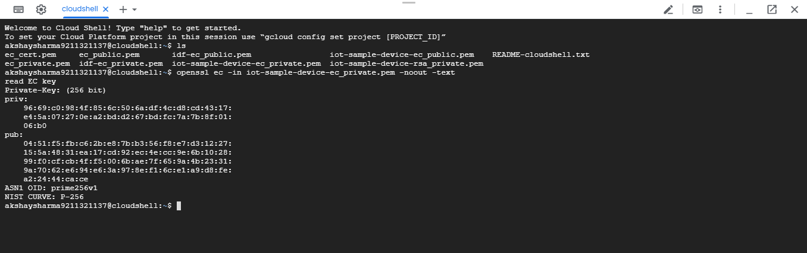
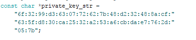
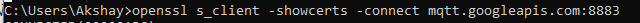
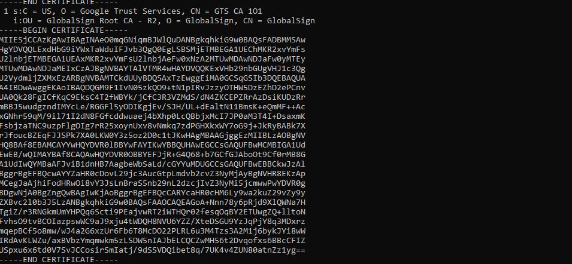
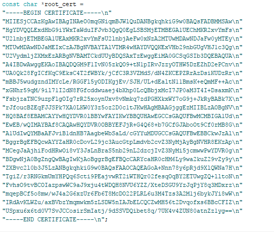

## ON Google IOT core 

1) In the project 

(Change topic  name , registry name acc to need and  region = us-cental1 for full features access on cloud )

​         (Change device name accordingly)

# Setup Arduino IDE

1) Install following libraries:-

​      1)Google Cloud IoT Core JWT (Available in Arduino Ide library Manager)

​       2) MQTT.h (https://www.arduinolibraries.info/libraries/mqtt)

​       3) ESP32 WifiClientSecure

 2) Change wifi and cloud iot credentials in ciotc_config.h

  3) edit private key in private_key_str 

run "openssl ec -in <private-key.pem> -noout -text " in gcp console and copy the key

4)  edit root_cert: To get the root_cert

Within a terminal or cmd ("run cmd as administrator"), 

run  "openssl s_client -showcerts -connect mqtt.googleapis.com:8883"   

