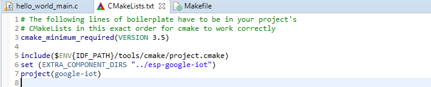
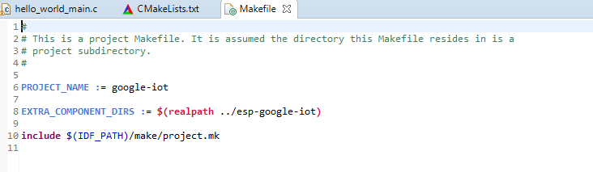
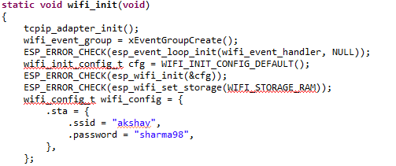
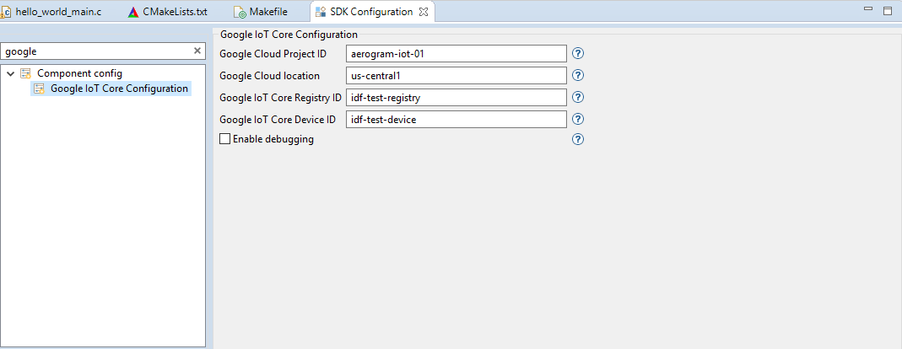
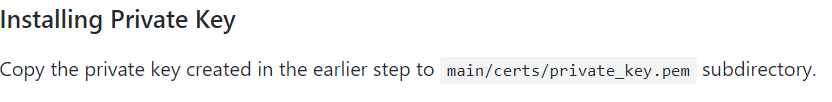
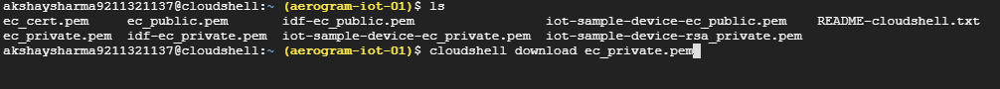
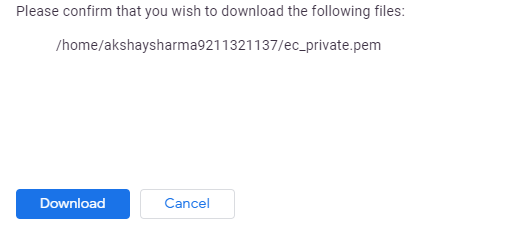

# ESP-Google-IOT Setup with IDF

 1) Clone the Google Cloud IoT SDK for IDF  from https://github.com/espressif/esp-google-iot

2) to use external library

​     (Add  path of library  in "CMake.txt and Makefile" w.r.t to the path of these files) 

​      

​    

3)Change Wifi credentials in wifi_init function 

4)Cofigure  the IOT core Credentials in Sdkconfig 

5) 

(TO download key from Cloud use command cloudshell download "Filename" )

## This program is currently publishing data on the google cloud 